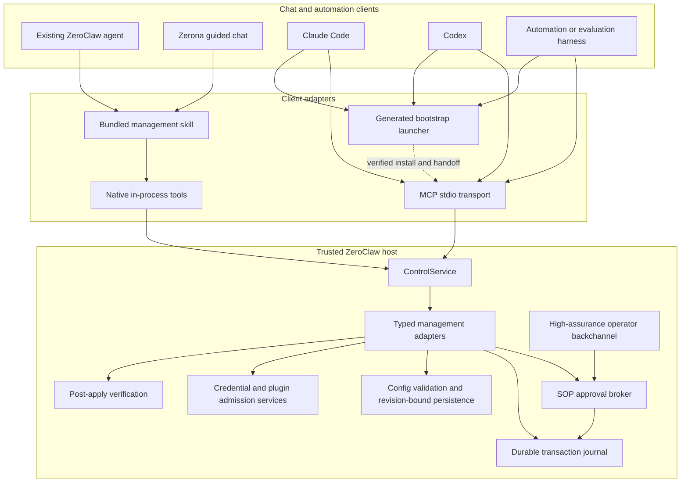

# Chat-based management control plane

> **Status: proposed.** This page describes a target architecture. It does not
> describe a management MCP server or plugin that ships today.

ZeroClaw should be manageable through conversation without making a model the
authority over configuration. A user should be able to ask a ZeroClaw agent,
Claude Code, Codex, or another MCP-capable harness to create and manage agents,
providers, services, plugins, and policies. The calling agent interprets intent;
ZeroClaw validates and applies typed operations through its own control plane.

This architecture expands the focused Zerona agent-creation flow into a shared
management service. Zerona remains an optional guided persona. It is not a
second model that every caller must invoke.

## Goals

- Offer a full chat-based path for creating and managing a ZeroClaw instance.
- Let an external harness identify, verify, and install the correct ZeroClaw
  artifact before a local instance exists, then hand off to the same management
  protocol.
- Let existing ZeroClaw agents and external harnesses use one management
  contract.
- Keep configuration schema, validation, credentials, approvals, persistence,
  and verification under host authority.
- Include the management integration in every default installation while
  allowing the operator to disable it.
- Start no background process and make no model request until the integration
  is invoked.
- Prevent the client plugins, prompts, protocol, documentation, and host schema
  from drifting apart.

## Non-goals

- Exposing arbitrary TOML editing as a management operation.
- Letting an agent approve its own capability escalation.
- Giving a WASM guest ambient access to the host configuration or credential
  store.
- Sending secrets through model context or ordinary MCP tool arguments.
- Enabling or granting third-party plugins to every agent by default.
- Requiring a ZeroClaw model-provider call when Claude Code, Codex, or another
  harness is already conducting the conversation.

## Threat model and authority boundary

Management callers are untrusted requesters. A ZeroClaw agent, client plugin,
MCP process, model, skill, and automation harness may describe an operation,
but none is an operator principal merely because it runs locally or under the
same OS account as ZeroClaw.

The control plane is designed to prevent a model from turning its existing
tools into additional ZeroClaw capabilities through a confused-deputy path. It
does not claim to defend against an OS administrator, root process, or hostile
same-UID process that already has direct write access to the ZeroClaw binary,
config root, data root, approval key source, and operator browser credentials.
Such a process already has authority outside this protocol. The management
surface must not widen the authority of a caller that lacks those capabilities.

Transport provenance is not authentication. In particular:

- launching the stdio command does not create an operator principal;
- a TTY, loopback address, process parent, or same-UID check is insufficient by
  itself to approve a mutation;
- an agent that launches the stdio command through shell remains an agent
  requester;
- raw access to the config or approval store is not granted by the management
  integration; and
- mutation remains unavailable until a separate high-assurance operator
  backchannel is configured.

The first default-enabled release is therefore read-only. It may inspect,
validate, and preview. It cannot create an approval or apply a mutation until
the operator completes the management enablement ceremony described below.

## Companion implementation

The staged Zerona successor stack is a focused interactive CLI flow. It is not
part of the current release until its companion pull requests land:

- `zeroclaw onboard` requires a terminal.
- `ZeronaSession` selects one existing capability-restricted model provider and
  performs the guided conversation itself.
- `SafeInventory`, proposal guards, and typed validation accept one contained
  agent proposal.
- The proposal can choose an existing provider, built-in risk/runtime presets,
  memory, and personality files.
- Channels, tools, credentials, MCP grants, plugins, and uncontained postures
  are deliberately excluded.
- The CLI builds a redacted preview, binds it to the exact source revision,
  requests terminal approval, applies through Quickstart, and verifies the
  resulting configuration and personality files.
- The SOP run and conversation state are process-local.

The safe inventory, guards, proposal validation, preview, source-revision
binding, atomic apply, and verification are reusable. Terminal input, embedded
provider conversation, and process-local orchestration are adapters, not the
future source of truth.

## Target architecture



### ControlService

`ControlService` is the only management authority. It owns a typed transaction
over a target ZeroClaw instance. It does not conduct a conversation or select a
model. Its responsibilities are:

- expose a secret-free live inventory;
- resolve available management adapters;
- validate typed operations against the current configuration;
- produce a redacted effect and risk preview;
- bind a proposal to the target, source revision, caller, and expiration;
- request approval from an authenticated operator principal that is distinct
  from the requester;
- consume a single-use approval and apply through a durable transaction
  journal;
- verify the effective runtime result; and
- emit tamper-evident audit records without exposing credential material.

The service should extend or replace the narrow `zeroclaw-onboarding` service
boundary after the agent-creation behavior is stable. User interfaces must not
reimplement its validators or persistence rules.

### Inventory disclosure

Catalog describes product-supported operation kinds and contains no configured
instance state. Inspect is filtered by the requester's target and domain grant.
It may return granted aliases, typed availability, bounded health categories,
and redacted policy summaries needed for one operation. It does not return:

- secret or encrypted values;
- absolute config, data, workspace, credential, or plugin paths;
- account identifiers or raw provider error bodies;
- ungranted agent, integration, MCP, plugin, or policy aliases;
- raw logs, environment values, headers, or plugin configuration; or
- the existence of another registered target.

Each adapter declares the minimum disclosure required for its typed operation,
and the framework enforces the grant before resolving that view. Redaction must
be covered by fixture tests for both successful and error responses.

### Native and MCP transports

ZeroClaw agents use native in-process tools backed by `ControlService`. They do
not need to spawn a child `zeroclaw` process.

External harnesses launch an on-demand stdio server, provisionally:

```text
zeroclaw control --mcp
```

Both transports expose the same request and response types. Transport parity
must be tested: a proposal sent through native tools and MCP must produce the same
canonical preview, operation digest, requester classification, and
authorization result.

Native and MCP transports create requester principals only. They cannot create
an operator principal or submit an approval decision. A self-launched stdio
server is unregistered and receives no inventory, proposal, or review tools;
parent process, same UID, loopback, and environment variables never upgrade it.
Mutating requests always enter the host approval broker. In daemon-proxy mode,
the stdio process cannot execute them. In exclusive local-host mode, the same
process may run the transaction worker only after a separate operator receipt
is durable; the MCP request handler never becomes an apply authority.

When the daemon owns a registered target, the stdio process is a protocol proxy.
It reaches the host through a permission-checked Unix-domain socket or
platform-equivalent named pipe. Peer credentials are attribution only. The
proxy and host perform a challenge exchange authenticated by the registered
client credential, and every request repeats the registered client ID, target
ID, protocol version, and challenge-bound session ID. The socket path,
permissions, and credential verifier are outside every agent sandbox root.

When ZeroClaw is installed but the daemon is not running, the same command may
host `ControlService` locally after acquiring the exclusive control-host and
instance locks. It uses the same target registry, journal, key source,
authorization checks, and recovery rules as daemon mode. It refuses to start if
another host owns either lock. The launching MCP session remains a requester,
and local hosting does not create an operator principal or a second apply path.
A failed daemon challenge that cannot safely fall back to the exclusive local
host leaves configured-state methods unavailable.

An external MCP client must present a client credential created by an operator
registration ceremony. The credential identifies a client and grants explicit
instances, read domains, and proposal domains. It never grants approval.
Credential material is obtained by the stdio proxy through an approved
client-specific credential helper or inherited descriptor, not a command-line
argument, ordinary environment variable, prompt, or model-visible config.

Client registration records a credential-delivery assurance class:

- **isolated descriptor:** a supervising client passes the credential through
  an inherited descriptor unavailable to agent subprocesses;
- **sandbox-isolated store:** an approved helper reads a credential from a
  client store outside every enforced agent sandbox root; or
- **UID-ambient:** another process under the same OS account may obtain it.

The first release accepts only the first two classes for Inspect, Propose, and
Request apply. UID-ambient delivery receives no configured-state tools. A host
cannot classify a store as sandbox-isolated while any shell-capable agent runs
without an enforced sandbox that excludes the store and control socket. If the
host cannot prove that separation, the client remains unregistered and the
stdio endpoint exposes exactly Initialize, Ping, ServerInfo, and
RegistrationHelp. Catalog, Describe, Inspect, Validate, Preview, Request apply,
Status, and Verify require a registered requester grant.

Delivery assurance participates in requester reachability, authorization, and
audit attribution. It is re-evaluated when agent sandboxes, shell grants,
client helpers, or credential locations change. An agent that can resolve a
registered client's credential gains no authority from the claimed client
name. The effective grant is intersected with every principal that can reach
the credential; one reachable ungranted principal collapses it to no
configured-state access.

Native agent grants and external client grants compile to the same
`ControlRequesterGrant`. Authorization is the intersection of that grant,
current policy, target registration, and operation class. A requester denied
Inspect or Propose natively remains denied through MCP. Client registration,
grant widening, revocation, and credential rotation are meta-authority
operations.

The stdio process pins its config and data roots at startup. No tool accepts an
arbitrary target path. An existing root must be the default instance or an
operator-registered target. A new isolated root must be under an
operator-approved parent. Its canonical path and instance fingerprint appear
on the security-authoritative operator backchannel. The requester-facing
preview carries only the granted target ID and fingerprint. A caller cannot
convert read access to an unregistered root into mutation authority by choosing
a different launch argument.

The host maintains a signed target registry keyed by stable instance ID. Each
record contains canonical config and data roots, ownership and permission
checks, allowed creation parent, instance fingerprint, trust epoch, and status.
Genesis registers the default instance. Registering another existing root or
an approved creation parent is a meta-authority operation. Apply resolves the
target ID from this registry under the registry and instance locks; the caller
never supplies a path at apply time.

The instance fingerprint commits to the instance ID, genesis-record digest,
trust epoch, canonical roots, filesystem object identity where available,
owner, and security-relevant permissions. The host recomputes it under lock
before preview and apply, so replacing a registered root or redirecting it
through a symlink expires the proposal.

Creating a new instance is a proposal against an already registered creation
parent and is always a meta-authority operation. The host rejects symlink
traversal, a non-empty unmanaged target, a root outside that parent, and a root
whose owner or permissions do not match policy.

By default, the child genesis record inherits the approving instance's operator
set, assurance policy, and deployment trust root while generating a distinct
instance ID and host key. A proposal that names a different first operator,
key source, or trust policy remains meta-authority and displays those values
verbatim in the preview and operator decision. A first operator must reference
an operator identity already registered in the parent trust epoch or a
verifiable identity fingerprint validated by the parent operator backchannel.
Proposal-supplied opaque key material is not accepted. The parent audit chain
records the child genesis digest, and the child records the parent operation
digest as its genesis anchor. The child remains read-only until its genesis
record is durable and its own mutation-enablement ceremony completes.

HTTP or remote MCP transport is outside the first version. It requires a
separate authenticated-principal and network-exposure design.

### Bootstrap before ZeroClaw exists

An MCP server inside the ZeroClaw binary cannot install that binary when it is
absent. Generated Claude Code and Codex packages therefore include a small
bootstrap launcher beside the management skill. The launcher is a distribution
client, not a second configuration service, and exposes only four conceptual
operations:

| Operation | Effect |
|---|---|
| Bootstrap status | Detect the platform, an existing binary, and its verified version |
| Plan install | Select one supported artifact and show version, channel, source, digest, signature status, install path, and privilege requirements |
| Install | Download and install exactly the approved immutable artifact |
| Handoff | Execute the installed `zeroclaw control --mcp` and verify its initialization identity |

The target and artifact mapping is generated from the canonical distribution
registry in the main repository. That registry is tested against the release
matrix, required assets, `install.sh`, `setup.bat`, and the built-in updater.
The launcher contains no configuration schema, provider catalog, adapter
metadata, or management authority.

Installation changes executable state and always requires an explicit human
decision through the harness or an OS-mediated user-presence surface. A model
may request an install but cannot satisfy that decision in an MCP argument. The
launcher accepts no arbitrary download URL, shell command, release asset name,
or install root. It resolves a supported target and version, downloads from a
pinned official release origin, verifies the expected digest and release
signature, rejects redirects or target mismatches outside policy, and installs
only under the approved platform location.

The bootstrap launcher cannot inspect or write `config.toml`, collect provider
credentials, initialize the management trust root, or approve a proposal. Once
handoff verifies the installed product version, control-protocol range,
capability digest, and executable identity, the launcher exits. All later setup
and management uses the installed host. An existing binary with an unsupported
or unverifiable identity produces an upgrade or repair plan instead of being
silently replaced or executed.

### Skill, plugin, and Zerona

These terms describe different layers:

- The **management skill** teaches a model how to discover capabilities,
  gather intent, explain previews, and wait for approval. It carries no
  configuration authority.
- The **client plugin** packages the skill and MCP server declaration for a
  particular harness. It contains no independent copy of the ZeroClaw schema.
- **Zerona** is an optional friendly management persona and guided workflow. An
  existing agent can call the management tools without invoking a separate
  Zerona agent.
- The **WASM plugin system** remains the sandbox for third-party executable
  extensions. The control plane is not a WASM guest.

ZeroClaw currently has no formal `system plugin` category. The default feature
should therefore be described as a bundled management integration, backed by
trusted host code, rather than overloading the existing WASM plugin contract.

## Management domains

Management behavior is divided into typed adapters. Every adapter owns its
catalog metadata, requirements, service-credential authorization ceremony,
validation, preview, application, verification, and documentation metadata.
An adapter cannot classify approval, mint principals, consume receipts, or
change the framework's operation tier.

An adapter does not define a second configuration schema. Its request and
effect types reference or generate from the canonical ZeroClaw config and
policy types. Adapter-owned metadata covers procedural facts that the config
schema does not express, such as an OAuth ceremony or connectivity check. The
framework derives proposal dependencies and effect digests from the typed
operation; neither the caller nor free-form model output selects the fields
that participate in drift detection.

Initial and expected domains include:

| Domain | Example operations |
|---|---|
| Instance | Initialize an isolated config root, inspect health, plan migration |
| Agent | Create, update, disable, or retire an agent |
| Provider | Add authentication, test a model, create an alias, switch binding |
| Integration | Configure email, Google Workspace, or a channel |
| MCP | Define a server and bundle, then grant it to selected agents |
| Skill | Install, configure, grant, update, or disable a skill |
| Plugin | Search, inspect, install, configure, grant, update, disable, uninstall |
| Policy | Explain effective access and propose a narrower posture |
| SOP | Install or configure a workflow and inspect its runs |
| Maintenance | Diagnose health, preview upgrades, and verify recovery |

An adapter must not accept a raw config path plus arbitrary JSON value as its
primary interface. It may use config-patch internals after its typed operation
has been validated.

## Conversation and tool contract

The caller owns the conversation. The control plane exposes a small stable
orchestration surface plus dynamically described adapter operations. Exact
names remain a protocol-design decision; the conceptual operations are:

| Operation | Host effect | Purpose |
|---|---|---|
| Catalog | None | List supported domains and operations from the running host |
| Describe | None | Return the current typed requirements for one operation |
| Inspect | None | Return a redacted view of current relevant state |
| Validate | None | Validate a proposed typed operation |
| Preview | None | Return canonical effects, risks, and verification plan |
| Request apply | Durable journal only | Park an immutable proposal for operator review |
| Status | None | Report the exact durable transaction state and bounded progress |
| Verify | Verification reads | Confirm effective state and report bounded diagnostics |

The model cannot satisfy approval by passing `approved: true`, replaying a
nonce, calling a second tool, or invoking a different transport. There is no
model-callable Finalize operation. A trusted operator backchannel approves the
exact parked proposal, and the host transaction worker claims and applies it.
The requester observes progress through Status.

MCP prompts and client skills may improve the interview, but clients must call
Catalog and Describe rather than relying on a copied list of fields or
integrations.

## Transaction and state model

Every mutation follows one transaction:

```text
inspect -> propose -> validate -> preview -> approve -> apply -> verify
```

A proposal is immutable and bound to:

- target instance identity and pinned roots;
- exact source-config revision;
- registered requester identity, client session attribution, and owner token;
- canonical operation payload and digest;
- host-derived dependency set and pinned external facts;
- declared effects and verification plan; and
- expiration time.

Conversational drafts may remain process-local. Once Request apply succeeds,
the immutable proposal, owner binding, dependency digest, and expiration are
durable. Persisted proposals are not enumerable across owners; an opaque client
resume secret can access only one proposal bound to the same registered client
or native agent identity. The store keeps only its verifier. Relaunching stdio
requires both the client credential and resume secret. Neither conveys approval
authority, and both expire with the proposal.

The transaction journal has explicit states:

```text
prepared -> awaiting_approval -> approved -> applying -> applied -> verified
                |-> rejected         |          |-> failed
                |-> expired          |          |-> recovery_required
```

An approval receipt is single-use and bound to the proposal digest, target
instance, source revision, operator principal, decision, and expiration. The
broker signs or authenticates it with a host key source unavailable to the
requester tool surface.

The broker records a valid receipt and the `approved` transition in one durable
journal transaction. Before entering `applying`, the host:

1. acquires the exclusive instance config and transaction lock;
2. re-reads the source revision and framework-derived dependencies;
3. verifies every pinned external fact represented in the preview;
4. starts one journal-database transaction;
5. verifies and consumes the approval receipt while changing `approved` to
   `applying`; and
6. commits and syncs that transaction before changing config.

Receipt consumption and the `applying` record are therefore one atomic durable
fact. A crash before commit leaves `approved` with an unconsumed receipt. A
crash after commit leaves `applying` with a consumed receipt, which authorizes
the recovery service to continue or classify only that exact operation.

The config commit uses the existing expected-source transaction and records the
expected post-image digest. Because a config-file rename and journal update
cannot be one filesystem transaction, restart recovery compares the current
config digest with the recorded pre-image and post-image. It classifies the
operation as not applied, applied but not verified, or ambiguous. It never
blindly repeats a mutation. An ambiguous result parks in
`recovery_required` for operator resolution.

The same rule covers every declared effect artifact, not only `config.toml`.
An adapter records pre-state, expected post-state, and rollback or
classification logic for plugin bytes, personality files, credential-store
entries, service state, and other durable effects. Apply ordering is recorded
in the journal. If any effect cannot be classified after interruption, the
whole operation parks in `recovery_required`; recovery does not infer success
from the config digest alone. Irreversible external side effects are identified
in the preview and cannot occur before approval.

If the source revision, dependency set, provider target, plugin package, OAuth
scope set, endpoint identity, policy, or other previewed fact changes before
apply, the proposal expires. The caller must request a new preview. Health
observations that cannot be frozen are labeled as observations and repeated
during verification rather than presented as apply-time guarantees.

Approval consumption and the first `applying` record are durable before the
config write. A terminal or recovery outcome is durable before another request
with the same operation identifier can proceed. Reverting an applied change
does not make its approval reusable.

Status uses the journal state names above. It may add bounded progress details
but does not collapse `approved`, `applying`, or `recovery_required` into a
generic pending result.

The journal database lives under the registered instance data root and is
covered by the target registry's ownership, permission, symlink, and trust-epoch
checks. Proposal, receipt, and resume-secret expiration use a server wall-clock
timestamp plus a monotonic deadline while the process remains alive. After a
restart, clock rollback or an ambiguous time source expires the credential
rather than extending it.

Each requester has bounded prepared and awaiting-approval quotas, request rate,
and total parked bytes. Exceeding a quota refuses a new proposal without
evicting another client's state or generating operator notifications.

Operations that remove or replace state must create a recoverable snapshot or
declare why no rollback artifact is possible. Approval text identifies that
difference.

## Identity, authorization, and approval

Availability is not a grant. The management integration can ship enabled while
remaining unavailable to ordinary agents.

### Trust-root genesis

Genesis and trust-root recovery are the only management transitions that do not
consume a prior management approval receipt. Both require genesis-equivalent
assurance under the exclusive bootstrap lock and are not exposed through native
tools or MCP. First genesis is permitted only when no control-plane genesis
record or managed-instance marker exists. Re-running it against an initialized
instance fails closed; recovery uses the separate procedure below.

An interactive installation uses an OS-mediated user-presence ceremony to:

1. generate and seal the host approval/audit key in a platform key source;
2. register the first operator public identity;
3. assign a stable instance identifier to the canonical config and data roots;
4. write and sync an immutable genesis record containing the trust epoch; and
5. leave mutations disabled until the operator separately enables them.

An ordinary terminal prompt, loopback connection, or anonymous CLI invocation
does not satisfy genesis. If the platform cannot provide user presence or a key
source outside the requester tool surface, the installation remains read-only.

A headless deployment supplies a genesis manifest through its deployment trust
root. The manifest contains the instance identity, canonical roots, first
operator public key, host key-source declaration, and an administrator
signature or platform attestation. The corresponding operator private key
remains on a separate operator device. A headless agent, channel bot, or MCP
client cannot create or replace that manifest through ControlService.

The genesis record is the root of trust for later operator, client, target, and
key changes. Those later changes are ordinary meta-authority operations and do
require a receipt issued under the existing trust epoch.

### Trust-root recovery

Recovery requires at least genesis-equivalent assurance. An interactive host
uses the OS-mediated user-presence ceremony; a headless host requires a
deployment-trust-root-signed recovery manifest. Recovery runs under the
exclusive bootstrap lock and is not reachable through ControlService, native
tools, MCP, an anonymous CLI mode, or an approval backchannel being replaced.

The recovery manifest binds the instance ID, prior genesis-record digest,
prior audit-chain head, reason, new operator set, new host key commitment, and
new trust epoch. Interactive recovery binds those same facts into its
user-presence-authorized recovery record. When the old host key remains
available, the epoch transition is authenticated by both old and new keys.
When it is lost, the deployment trust root or OS user-presence authority
authorizes the break and the first new-epoch row commits to the last verified
old-epoch chain head. Recovery invalidates all pending proposals, client
credentials, approval receipts, and resume secrets.

Startup distinguishes ordinary first genesis from recovery by the durable
instance identity and prior genesis record. Deleting a key, journal, or current
config file does not make an initialized instance eligible for first genesis.
A managed root with a missing or invalid genesis record enters recovery-only
mode and cannot create a replacement genesis through the first-run path.

The control plane uses explicit principal classes:

| Principal class | Source | Authority |
|---|---|---|
| Agent requester | Runtime-derived agent identity | Inspect, propose, and request review only when granted |
| External requester | Registered MCP client identity | Inspect, propose, and request review only within its grant; never approve |
| Operator | Paired or user-presence-authenticated human identity | Approve within configured policy |
| Recovery service | Host startup recovery worker | Resume or classify an already-authorized journal entry; never approve a new proposal |

### OIDC scope for v0.9.0

OIDC is not a prerequisite for the first local stdio MCP or the bootstrap
launcher. Local requester authentication uses the registered client credential,
and interactive operator authority uses the OS or paired backchannel ceremony
described here.

The planned v0.9.0 identity work can supply a human identity to a paired
Operator Console, client-registration ceremony, or future remote transport. The
verifier must pin issuer, audience, client, redirect, nonce, proof-key, and
subject mapping before producing an operator or administrative principal. An ID
token in an ordinary MCP argument, environment variable, model message, or
loopback request is never proof of operator authority. OIDC authentication also
does not promote the requesting agent or external MCP client; it authenticates
the separate human backchannel that issues or approves a bounded action.

Transport labels are attribution, not proof of identity. The current SOP
concept of any non-agent source being out-of-band is insufficient for control
mutations. The target implementation must carry an authentication assurance
level produced by the trusted transport or OS user-presence adapter. A client
body, MCP argument, environment variable, loopback connection, TTY, process
parent, or same-UID status cannot choose that level.

Acceptable operator backchannels include a paired Operator Console session, a
configured channel identity whose credential is not available to the requester,
or an OS-mediated user-presence ceremony. An ordinary anonymous CLI invocation
is a requester, not an operator. At least one high-assurance backchannel and an
approval-signing key source outside the requester tool surface are prerequisites
for enabling mutations.

Approval uses a fresh challenge bound to the proposal digest and operator
identity. A text code, message content, or button payload visible to the model
is not sufficient. The backchannel must authenticate the human identity through
a paired credential, platform user identity, or operator-device signature.

Before requesting or accepting approval, the host computes whether the
requester can act as the operator identity or access its signing credential.
That operator is ineligible when the requester can do so. Granting an agent,
plugin, MCP server, provider, or integration access that would expose or
impersonate an approval identity is a meta-authority operation and revalidates
all configured backchannels. A channel is high-assurance only when the host can
distinguish the human responder from the agent or bot identity. Management
approval does not use model-visible free-form text replies.

Reachability analysis is conservative. If the host cannot prove that a broad
egress grant, plugin, delegated credential, or integration cannot reach or
impersonate the operator identity, it treats that identity as reachable and
ineligible for that requester.

For a headless host, the first supported backchannel is a paired operator
device or an authenticated platform-user action delivered by a channel adapter
that preserves that distinction. If no eligible operator remains after a
configuration change, mutations fail closed.

The broker emits a single-use authenticated approval receipt. The receipt is
bound to the exact proposal and consumed by the transaction worker. Approval
records and audit records are append-only and tamper-evident. Invalid,
unverifiable, replayed, or expired records fail closed. The threat model does
not treat a caller that can already overwrite the host executable, approval
key source, and transaction store as contained by this protocol.

Each audit row carries a monotonic sequence, trust epoch, operation identifier,
previous-row digest, and host-key authentication tag. The journal transaction
commits the audit row with the state transition it describes. Startup and audit
reads verify the chain from the genesis anchor. A gap, rewrite, invalid tag, or
unexpected epoch disables mutations and enters recovery. Deployments that need
evidence beyond the host-compromise boundary may anchor periodic chain heads in
an external operator-owned store.

A planned host-key rotation appends an epoch-transition row authenticated under
the old key and committing to the new public key or verifier. The first row in
the new epoch commits to that transition. A lost-key recovery uses the
deployment-authorized cross-epoch anchor described above instead of pretending
the old key signed the change.

The first stable protocol has no unapproved mutation class. Every mutation
requires a high-assurance operator decision. Introducing a no-approval mutation
class later requires a new architecture decision and cannot include capability
widening, credentials, trust roots, executable installation, or authority
policy.

Some operations are permanently meta-authority changes:

- enabling management mutations;
- changing approval modes, groups, quorum, principal links, or backchannels;
- changing management or audit key sources;
- registering target roots or approved creation parents;
- registering or widening an external client grant or changing its credential
  delivery assurance;
- creating a child instance or changing its inherited operator or trust set;
- changing a grant or binding that can expose or impersonate an operator
  backchannel identity;
- widening policy or granting management to the requester;
- trusting a plugin publisher or enabling the external WASM plugin system; and
- changing the rule that classifies an operation as requiring approval.

Meta-authority changes always use the strongest confirmation tier and can
never be placed in a no-approval class. When at least two eligible operators
exist, they require at least two distinct operator principals and no fewer than
the configured quorum. A single-operator installation requires one
user-presence-authenticated operator distinct from the requesting agent or MCP
session.

ZeroClaw agents receive native management tools only through an explicit grant.
An agent that invokes the stdio binary through shell is still only an external
requester and cannot turn process launch into an approval. Existing sessions do
not silently gain capabilities after config apply; restart and reload semantics
remain explicit.

Remote transport requires a separate authenticated-principal and
network-exposure design before it can be enabled.

## Credentials and authorization flows

Secrets never pass through model-visible tool arguments or responses. A
management adapter can return a bounded authorization handle and status, while
the host performs credential entry through an approved surface:

- browser OAuth or device-code flow;
- local terminal secret input;
- Operator Console secret form;
- existing encrypted credential profile; or
- platform secret source supported by ZeroClaw.

The model can ask whether authorization succeeded and continue the workflow. It
cannot read the resulting access token, refresh token, API key, client secret,
or encrypted config value.

Authorization scopes, issuer identity, account slot, endpoint identity, and
credential ownership mode are pinned in the approved proposal. A broader scope
or different issuer requires a new preview and approval.

Rotating credentials have one explicit ownership mode:

- **owned:** ZeroClaw performed the authorization and owns refresh and
  persistence;
- **linked:** another credential source remains authoritative and ZeroClaw
  resolves its current value without copying refresh ownership; or
- **snapshot:** an imported copy that cannot be treated as refreshable and must
  be re-imported or replaced when it expires.

The control plane never presents a copied refresh token as a durable shared
login. Credential failures return a safe typed status and remediation action
without including provider response bodies that may contain sensitive values.

## Plugin management

Plugin installation is a supply-chain and capability operation. A plugin
adapter must preview at least:

- registry and immutable package identity;
- version and content digest;
- signature and publisher trust status;
- host/WIT compatibility;
- declared capabilities and permissions;
- requested egress destinations and private-address exceptions;
- typed configuration requirements;
- agents that will receive the plugin; and
- whether the external WASM plugin system must be enabled.

The control plane does not silently trust a publisher key, install an arbitrary
URL, resolve `latest` after approval, or grant the installed plugin to every
agent. Resolution to a version and digest happens before approval.

Registry responses, manifests, publisher keys, compatibility metadata, and
artifact digests represented in the preview are pinned into the proposal.
Apply verifies the downloaded bytes against those facts under the instance
transaction lock. Trusting a new publisher, changing signature policy, or
enabling external WASM execution is a meta-authority operation and is never
combined invisibly with an ordinary plugin install.

The registry transport is untrusted. Preview-time authenticity comes from the
package signature and publisher trust root established by genesis or a later
meta-authority approval, not from the registry response. An unsigned or
untrusted package cannot be described as verified merely because its digest is
stable.

The egress list in a preview describes the policy that will be installed; it is
not the enforcement boundary. Apply and verification must prove that the WASM
host admission and runtime egress policy enforce the approved list.

Upgrade and removal previews include dependent agents, configuration migration,
rollback artifacts, and effective permission changes. A plugin whose admission
or verification result differs at apply time expires the proposal instead of
falling back to a weaker installation path.

## Default distribution and disable behavior

The management integration is compiled into and shipped with the default
ZeroClaw installation. Client-plugin templates and the management skill are
embedded or generated from canonical sources in the main repository so Cargo,
Homebrew, and release archives cannot omit a required file.

External harness packages also carry the generated bootstrap launcher and its
distribution manifest so they can reach the installed management server from a
machine where ZeroClaw is absent. The launcher is not resident after handoff and
does not become part of the trusted configuration host.

A proposed configuration surface is:

```toml
[management]
enabled = true
mutations_enabled = false
```

`enabled = false` removes native management tools and makes the MCP entry point
return a stable disabled result. `mutations_enabled = false` retains redacted
inspection, validation, and preview while refusing Request apply, durable
proposal parking, approval, and apply.

Mutation enablement is a host-owned bootstrap ceremony, not an MCP operation.
It requires a configured high-assurance operator backchannel, a usable
approval/audit key source, and explicit user-presence confirmation of the
canonical target instance. The ceremony records the enabled capabilities and
does not grant management tools to any agent.

`zeroclaw onboard` may guide a new installation through that ceremony, but it
must call the same ControlService and approval primitives. It does not retain a
second apply route whose anonymous terminal approval bypasses the control-plane
principal rules.

This switch is independent of `plugins.enabled`. The control plane must not
enable discovery or execution of third-party WASM plugins merely because the
bundled management integration is enabled.

## Lightweight execution requirements

Default inclusion must not imply a resident management service.

- No management process starts with the daemon unless an enabled caller uses
  the native tools.
- External MCP uses stdio and starts on demand.
- The bootstrap launcher starts only for status, install planning, an approved
  installation, or handoff; it has no resident mode.
- MCP mode does not make an LLM request.
- ZeroClaw agents use the in-process service rather than spawning a second
  ZeroClaw process.
- No WASM instance is needed for the bundled management integration.
- New production dependencies require a size and maintenance justification;
  existing JSON-RPC and Serde types are preferred.

Release validation records optimized binary and package deltas. Initial targets
are zero idle CPU, no idle process, less than 100 KiB of embedded instruction
assets, and less than 2 MiB optimized binary growth. Growth above 5 MiB requires
an architecture review rather than an undocumented exception.

## Drift prevention

The main ZeroClaw repository is the canonical source for the service, protocol,
schemas, management skill, reference client-plugin sources, and tests.
Marketplace repositories may mirror generated release artifacts; they are not
independent implementations.

The following rules are mandatory:

1. MCP schemas are generated from the Rust request and response types.
2. Config field metadata comes from the canonical ZeroClaw schema.
3. Adapter requirements and docs metadata come from the adapter implementation.
4. Client skills call Catalog and Describe instead of listing fields manually.
5. Claude Code and Codex packages are generated from shared canonical source.
6. Manual edits to a generated distribution mirror fail CI.
7. Regeneration in the main repository must leave the worktree clean.
8. Embedded skill and prompt assets are covered by the signed release artifact;
   external client packages record and verify the matching source digest.
9. CI proves every adapter config effect is generated from, or a validated
   subset of, the canonical config schema for the advertised schema version.
10. Bootstrap target metadata is generated from the canonical distribution
    registry, and parity tests fail when release assets, installers, the updater,
    or a generated client package drift.

Every MCP initialization response advertises:

```json
{
  "zeroclaw_version": "0.9.0",
  "control_protocol_version": "1.0",
  "config_schema_version": 3,
  "capabilities": ["agents", "providers", "plugins"],
  "capability_digest": "sha256:..."
}
```

Clients declare a supported protocol range. An unknown major version fails
closed. Additive minor capabilities are negotiated from the running server.
The server never weakens authorization, approval, redaction, replay, or drift
checks to accommodate an older client.

Compatibility follows these rules:

- the client and server must support the same control-protocol major version;
- a server minor version may add capabilities but cannot change the meaning of
  an existing operation;
- config-schema interpretation is server-owned, so clients submit adapter
  operations rather than version-specific config fields;
- the ZeroClaw product version is informational except where a package or
  adapter declares an explicit compatibility range; and
- the operator backchannel, not the requesting client, renders the
  security-authoritative effects and decision.

An operation declares required server and operator-backchannel capabilities.
If either side cannot represent every effect and confirmation requirement, the
operation is rejected rather than downgraded. The capability digest is bound
into every proposal so a server capability change invalidates an outstanding
preview.

CI must verify that:

- native and MCP paths produce equivalent previews;
- native and MCP paths produce equivalent requester classification and
  authorization decisions;
- generated schemas match the compiled types;
- adapter effect fields map to the canonical config schema without an
  independently maintained duplicate;
- client packages initialize against the built server;
- docs examples validate against current schemas;
- default install artifacts include the management integration;
- bootstrap packages select only registered release targets, verify immutable
  artifact identity, and hand off only to a compatible installed server;
- the disabled and read-only modes expose no mutation path;
- an unregistered or ungranted self-launched stdio client cannot Inspect,
  Propose, request review, or gain operator authority;
- protocol downgrade cannot remove a security-required capability; and
- tagged client packages record the matching source commit, protocol version,
  and artifact digest.

## Phased delivery

The control plane should land as a stack of reviewable changes:

0. **Distribution and bootstrap contract.** Add the canonical target registry,
   release/install/updater parity tests, generated bootstrap manifest, verified
   install plan, and exact-version handoff. It has no config-management tools.
1. **Service extraction.** Put current agent inventory, validation, preview,
   source binding, apply, and verification behind a transport-independent
   service without changing terminal behavior.
2. **Read-only MCP.** Add stdio initialization, Catalog, Describe, Inspect,
   Validate, and Preview for contained agent creation. Until client
   registration lands, fixture credentials are test-only and no default agent
   or external process receives a grant.
3. **Trust genesis and registration.** Add genesis, trust epochs, host and
   operator keys, external client registration, target registry, approved
   creation parents, and recovery entry points.
4. **Principal and approval contract.** Add requester principal classes,
   high-assurance operator authentication, signed single-use approval receipts,
   backchannel reachability checks, meta-authority rules, and native/MCP
   authorization parity. No mutating tool exists before this phase passes its
   adversarial gates.
5. **Durable approval-backed apply.** Add the proposal/transaction journal,
   source and dependency locking, approval consumption, crash recovery, status,
   and verification.
6. **Bundled management integration.** Add native tools, shared skill source,
   default-enabled but read-only configuration, distribution checks, and
   generated Claude Code and Codex client packages. Mutation enablement remains
   an explicit host ceremony.
7. **Provider adapter.** Support secure authentication, model verification, and
   provider alias creation.
8. **Service adapters.** Add email and Google Workspace through typed OAuth,
   scope, health, and capability-grant flows.
9. **Plugin adapter.** Add registry search, supply-chain preview, install,
   configuration, grant, update, and removal.
10. **Broader lifecycle management.** Add safe update, retirement, migration,
   policy audit, and maintenance operations.

Stages 0 through 6 prove the distribution, trust, and transport contract before
broadening what can be changed.

## Governance and compatibility

This control plane creates a default-distributed external protocol, a new
configuration-mutation authority, and new operator-principal policy. It
therefore requires an accepted RFC before the external MCP or mutating surface
is treated as an implementation detail. Changes to approval authority,
principal assurance, plugin trust, or the stable control protocol require the
matching architecture decision or foundation amendment rather than an
unannounced behavioral change inside an adapter PR.

Service extraction can proceed as a behavior-preserving refactor, but no PR may
claim the proposed control-plane architecture is accepted merely because the
shared service exists. Protocol major versions and deprecation windows are
explicit governance decisions.

## Required verification

Each phase adds behavior-boundary tests rather than prompt-only tests:

- an absent installation selects the correct registered target without
  accepting an arbitrary URL, command, asset name, or install root;
- a wrong digest, invalid signature, redirect outside policy, unsupported
  target, privilege mismatch, or missing human confirmation prevents install;
- bootstrap handoff verifies the executable identity, product version,
  protocol range, and capability digest before exposing management tools;
- daemon and exclusive local-host modes produce the same inventory, preview,
  authorization, journal, and verification result;
- concurrent daemon and local-host startup leaves exactly one lock owner;
- the current CLI and service produce identical contained-agent outcomes;
- MCP mode makes no provider call;
- one client cannot access another client's pending proposal;
- a requester cannot run genesis, replace its trust epoch, register a client,
  register a target, or approve a creation parent;
- genesis and recovery reject races, re-initialization, symlinked roots, and
  an invalid deployment manifest;
- a managed root with a missing genesis record enters recovery-only mode and
  cannot run first genesis;
- recovery requires genesis-equivalent assurance, links audit epochs, and is
  unreachable through native tools or MCP;
- a client credential reachable from an agent execution context cannot grant
  that agent the registered client's authority;
- child creation inherits approved operators by default, previews any
  non-inherited operator set, and remains read-only until genesis is anchored;
- stale source revisions and expired proposals fail before mutation;
- native and MCP callers receive the same requester authority;
- an unregistered stdio client exposes only Initialize, Ping, ServerInfo, and
  RegistrationHelp;
- an unregistered or ungranted agent that self-launches stdio cannot Inspect,
  Propose, request review, or approve;
- local control-channel challenge replay or peer-credential spoofing cannot
  replace registered-client authentication;
- granting an integration cannot make an approval identity reachable by the
  requesting agent without a meta-authority decision;
- forged, modified, expired, and replayed approval receipts fail closed;
- a caller cannot self-approve, alter principal classification, or widen its
  own grants;
- meta-authority changes cannot enter an unapproved operation class;
- secret values are absent from inventory, preview, errors, logs, and MCP
  responses;
- crash injection before and after every journal/config write produces a
  deterministic recoverable outcome and never repeats a mutation blindly;
- crash injection covers plugin, credential, personality, service, and other
  declared effect artifacts as well as config;
- crash injection around the atomic `approved` to `applying` claim leaves
  exactly one durable state and never loses or double-consumes a receipt;
- the config lock rejects concurrent apply and root-selection races;
- audit-chain gaps, rewrites, invalid tags, and trust-epoch mismatches disable
  mutation;
- planned key rotation and lost-key recovery preserve verifiable cross-epoch
  continuity;
- verification detects partial or ineffective configuration;
- disabled management exposes no tools capable of mutation;
- default-enabled management remains read-only until the operator ceremony;
- read-only mode refuses Request apply and creates no parked proposal;
- wall-clock rollback, restart ambiguity, and expired resume credentials never
  extend a proposal or receipt lifetime;
- protocol downgrade cannot disable a security-required control;
- plugin install pins the exact approved digest; and
- release packages preserve the generated client-protocol compatibility data.

## Open decisions

- Final product and protocol names: `control`, `management`, or another stable
  term.
- Which high-assurance approval backchannels are supported first. Mutation
  remains disabled when none is configured.
- Which platform key source and user-presence adapter implement interactive
  genesis on each supported OS.
- Which isolated-descriptor or sandbox-isolated credential delivery mechanism
  is available to each supported external harness and OS.
- Which generated bootstrap package format and human-confirmation surface each
  supported harness uses.
- Which v0.9.0 OIDC issuers and operator/client-registration surfaces are in
  scope; local stdio does not depend on that choice.
- Whether pre-review conversational drafts survive restart. Parked mutation
  proposals and transaction outcomes are durable regardless of this choice.
- The compatibility and deprecation window for control-protocol major versions.
- Which service adapters are trusted host modules and which can be described by
  a future signed onboarding metadata contract.

These decisions affect external compatibility or authority and must be settled
before the corresponding surface is declared stable.
